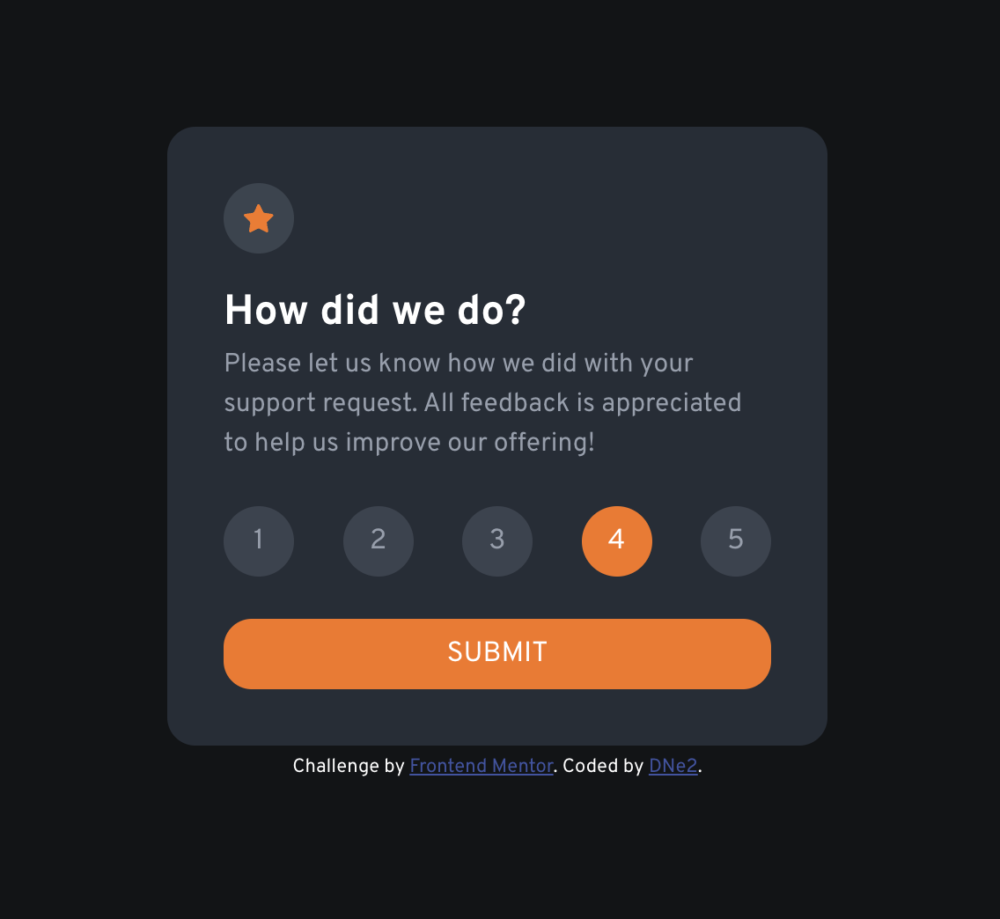

# Frontend Mentor - Interactive rating component solution

This is a solution to the [Interactive rating component challenge on Frontend Mentor](https://www.frontendmentor.io/challenges/interactive-rating-component-koxpeBUmI). Frontend Mentor challenges help you improve your coding skills by building realistic projects. 

## Table of contents

- [Overview](#overview)
  - [The challenge](#the-challenge)
  - [Screenshot](#screenshot)
  - [Links](#links)
- [My process](#my-process)
  - [Built with](#built-with)
  - [What I learned](#what-i-learned)
  - [Continued development](#continued-development)
  - [Useful resources](#useful-resources)
- [Author](#author)
- [Acknowledgments](#acknowledgments)

**Note: Delete this note and update the table of contents based on what sections you keep.**

## Overview

### The challenge

Users should be able to:

- View the optimal layout for the app depending on their device's screen size
- See hover states for all interactive elements on the page
- Select and submit a number rating
- See the "Thank you" card state after submitting a rating

### Screenshot

### Links

- Solution URL: (https://github.com/TechEdDan2/interactive-rating-component)
- Live Site URL: (https://techeddan2.github.io/interactive-rating-component/)

## My process

### Built with

- CSS custom properties
- Flexbox
- DOM

### What I learned

I was able to practice using the DOM for this exercise. 

### Continued development

I want to refactor the code a bit and use more of the DOM to style the project. 

### Useful resources

- [MDN](https://developer.mozilla.org/en-US/docs/Web/API/Document_Object_Model) - This helped me when using the Document Object Model to create this project. 
- [Udemy](https://www.udemy.com/course/the-web-developer-bootcamp) - This Udemy course has helped to learn how to use the DOM. I'd recommend it to anyone still learning this concept.

## Author

- Website - [Add your name here](N/A)
- Frontend Mentor - [@TechEdDan2](https://www.frontendmentor.io/profile/TechEdDan2)
- Twitter - [@TechEdDan](https://twitter.com/TechEdDan)

## Acknowledgments

I have been completing courses created by Colt Steele and Daniel Walter Scott, and use CSS Tricks, W3Schools and MDN to find answers to questions.  
